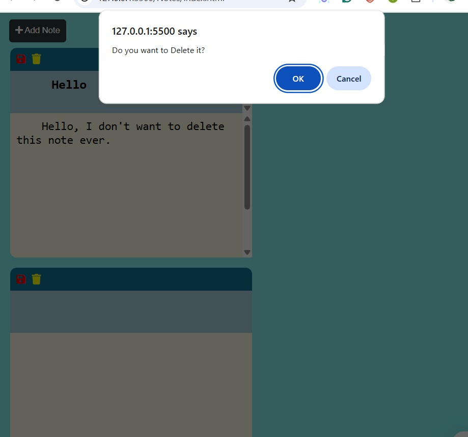

## Notes Website

Easily make and manage your notes through this website.

### Table of Contents
1. Demo
2. Features
3. Preview
4. Technologies Used
5. How It Works
6. Usage
7. Project Structure
8. Future Improvements
9. License

#### Demo
Check out the live version here-- https://notes-website-gamma.vercel.app/

#### Features
Create Notes: Add note titles and descriptions.

Save Notes: Persist your notes locally (e.g., browser localStorage).

Delete Notes: Remove unwanted notes.

User Confirmations: Pop-up confirmation dialog before deleting a note. 
GitHub

#### Preview

The repository includes the following screenshots for illustration:

Home Page: Interface for note creation, listing saved notes with title, description, and options to save or delete. 
GitHub

Pop-up Page: Confirmation dialog that appears before a note is deleted. 
GitHub

#### Technologies Used

HTML: Markup for structuring the web pages. (~15%) 
GitHub

CSS: Styling the interface for a clean and intuitive user experience. (~30%) 
GitHub

JavaScript: Adding interactivity—creating, storing, and deleting notes. (~55%) 
GitHub

#### How It Works

Create Note: Fill in the title and description fields, then click “Save” to add the note.

View Notes: Newly added notes appear instantly below.

Delete Note: Click the “Delete” button on a note; a confirmation pop-up appears to prevent accidental removal.

Storage: Notes are stored locally in the browser (e.g., via Web Storage API) to preserve them across sessions.

#### Usage

To run this project locally:

Clone the repository:

git clone https://github.com/tarungarg18/Notes-Website.git
cd Notes-Website

Open index.html in your favorite browser (e.g., double-click the file or use a simple HTTP server).

Start creating, saving, and deleting notes instantly.

#### Project Structure
Notes-Website/
 
├── index.html         # Main web page
 
├── style.css          # Styling and layout
 
├── script.js          # JavaScript logic for note management
 
├── Home.jpg           # Screenshot: main interface
 
├── pop_up_page.jpg    # Screenshot: delete confirmation dialog
 
└── README.md          # This documentation
 

GitHub

#### Future Improvements

Persist notes on the server-side or integrate with a database for accessibility across devices.

Add editing functionality to modify existing notes.

Introduce categorization, tagging, or search features for better note organization.

Enhance UI/UX with improved styling, animations, or responsive design.

Add user authentication for personalized note management.

#### License

This project is currently unlicensed. Feel free to apply an appropriate open-source license (e.g., MIT, Apache 2.0) depending on how you’d like others to use it.
